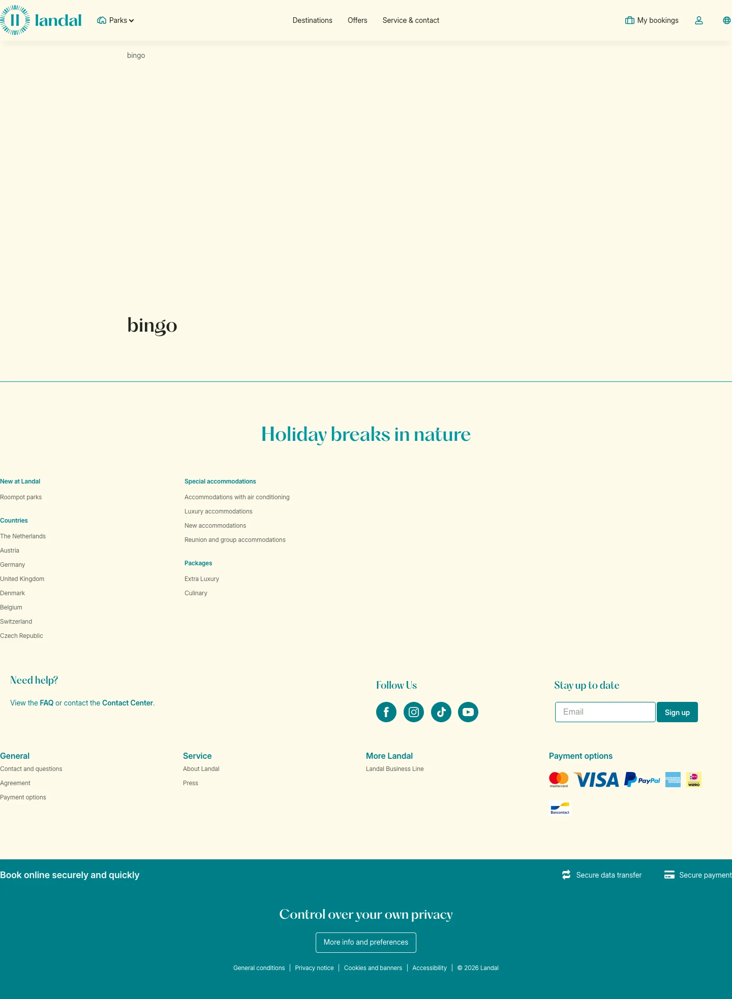

# bingo

**URL:** `/blog/bollo/bingo` · **Page type:** Stories blog article

## Section outline (top to bottom)

1. [Site Header](../components/site-header.md)
2. [Cashback Terms List](../components/cashback-terms-list.md)
3. [Facilities Text With List](../components/facilities-text-with-list.md)
4. [Site Footer](../components/site-footer.md)
