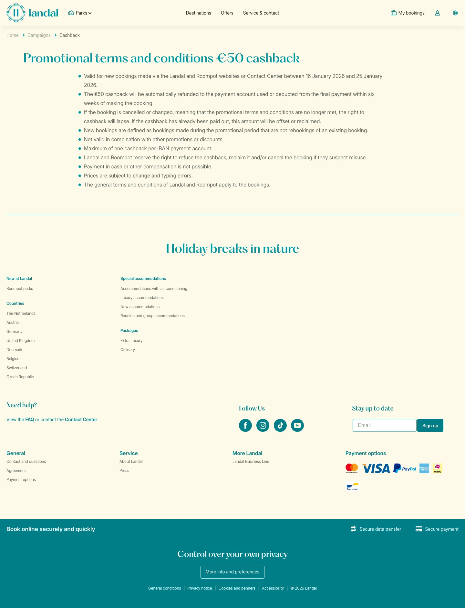

# € 50 cashback

**URL:** `/campaigns/cashback` · **Page type:** Offer detail

## Section outline (top to bottom)

1. [Site Header](../components/site-header.md)
2. [Cookie Bar](../components/cookie-bar.md)
3. [Accommodation Types Heading](../components/accommodation-types-heading.md)
4. [Cashback Terms List](../components/cashback-terms-list.md)
5. [Site Footer](../components/site-footer.md)
