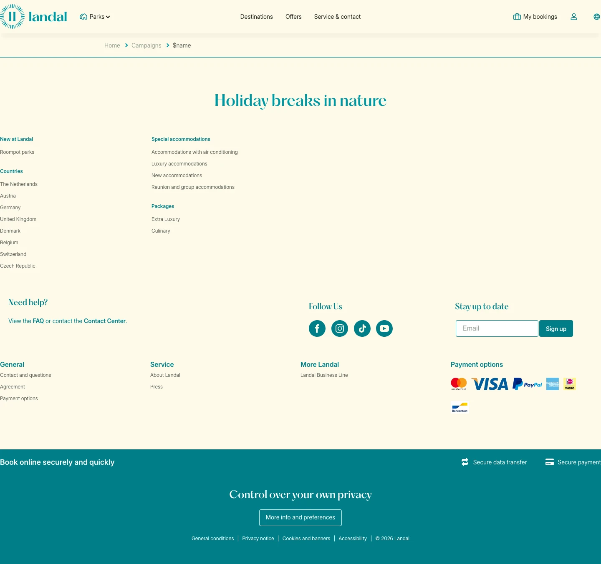

# Toddler time

**URL:** `/campaigns/toddler-time` · **Page type:** Campaigns

## Section outline (top to bottom)

1. [Site Header](../components/site-header.md)
2. [Site Footer](../components/site-footer.md)
