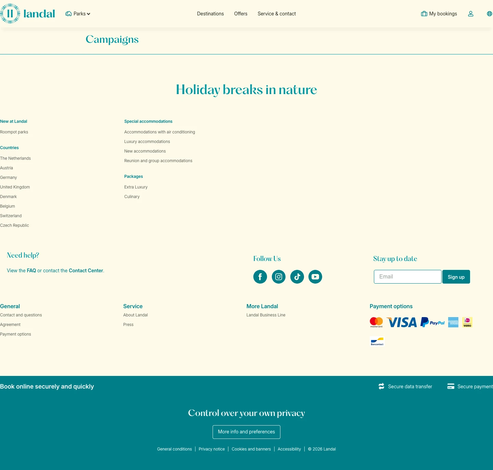

# Campaigns

**URL:** `/campaigns` · **Page type:** Offers overview

## Section outline (top to bottom)

1. [Site Header](../components/site-header.md)
2. [Site Footer](../components/site-footer.md)
