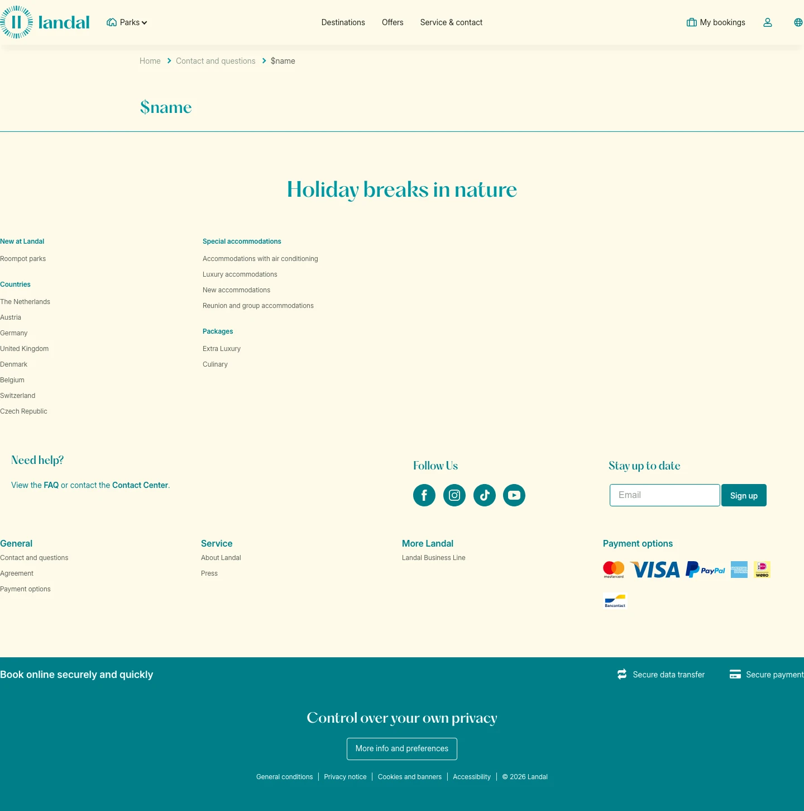

# Bedankt

**URL:** `/contact-and-questions/bedankt` · **Page type:** Service contactform completed

## Section outline (top to bottom)

1. [Site Header](../components/site-header.md)
2. [Cookie Bar](../components/cookie-bar.md)
3. [Facilities Text With List](../components/facilities-text-with-list.md)
4. [Site Footer](../components/site-footer.md)
