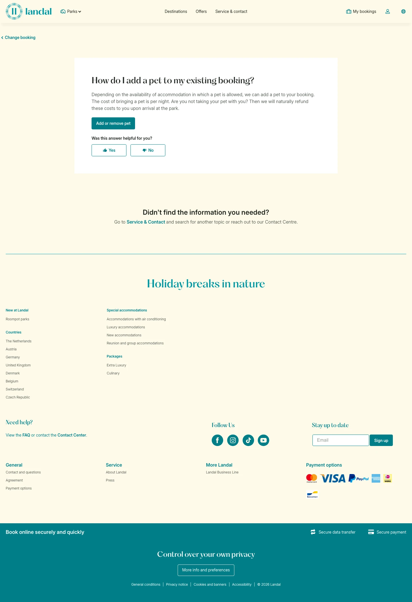

# How do I add a pet to my existing booking?

**URL:** `/contact-and-questions/betalen-en-wijzigen/change-booking/hoe-voeg-ik-een-huisdier-toe-aan-mijn-reservering` · **Page type:** How do I add a pet to my existing booking?

## Section outline (top to bottom)

1. [Site Header](../components/site-header.md)
2. [Cookie Bar](../components/cookie-bar.md)
3. [Icon Column Info Section](../components/icon-column-info-section.md)
4. [Photo Hero Banner](../components/photo-hero-banner.md)
5. [Site Footer](../components/site-footer.md)
