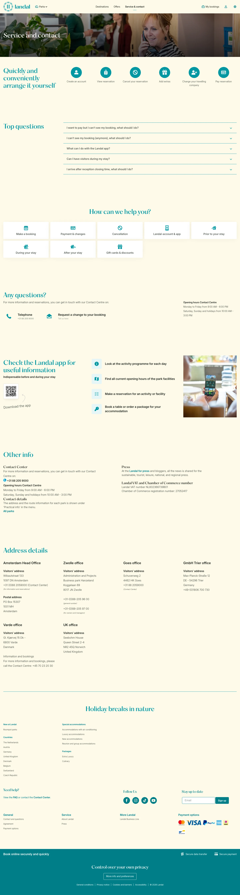

# Landal (contact-and-questions)

**URL:** `/contact-and-questions` · **Page type:** Selfservice contact

## Section outline (top to bottom)

1. [Site Header](../components/site-header.md)
2. [Photo Hero Banner](../components/photo-hero-banner.md)
3. [Expandable Info Accordion](../components/expandable-info-accordion.md)
4. [Expandable Info Accordion](../components/expandable-info-accordion.md)
5. [Expandable Info Accordion](../components/expandable-info-accordion.md)
6. [Expandable Info Accordion](../components/expandable-info-accordion.md)
7. [App Download Feature List](../components/app-download-feature-list.md)
8. [Contact And Press Details](../components/contact-and-press-details.md)
9. [Office Contact Directory](../components/office-contact-directory.md)
10. [Site Footer](../components/site-footer.md)
