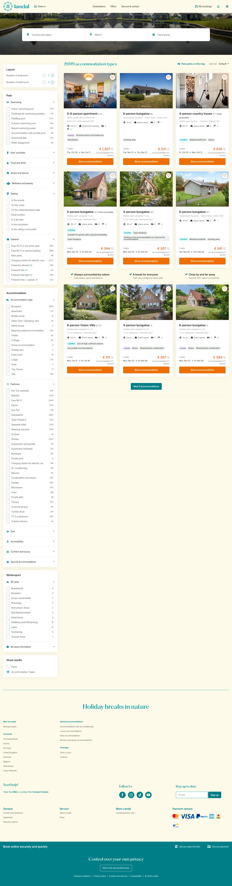

# Accommodations (destinations/accommodations)

**URL:** `/destinations/accommodations` · **Page type:** Destinations accommodations

## Section outline (top to bottom)

1. [Site Header](../components/site-header.md)
2. [Price Availability Calendar](../components/price-availability-calendar.md)
3. [Accommodation Listing With Filters](../components/accommodation-listing-with-filters.md)
4. [Site Footer](../components/site-footer.md)
