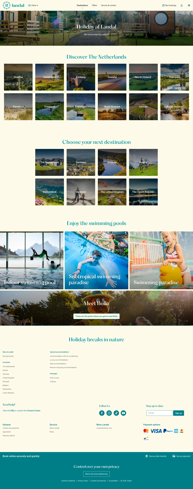

# Destinations

**URL:** `/destinations` · **Page type:** Destinations overview

## Section outline (top to bottom)

1. [Site Header](../components/site-header.md)
2. [Photo Hero Banner](../components/photo-hero-banner.md)
3. [Photo Category Tiles](../components/photo-category-tiles.md)
4. [Photo Category Tiles](../components/photo-category-tiles.md)
5. [Contact And Press Details](../components/contact-and-press-details.md)
6. [Photo Hero Banner](../components/photo-hero-banner.md)
7. [Site Footer](../components/site-footer.md)
