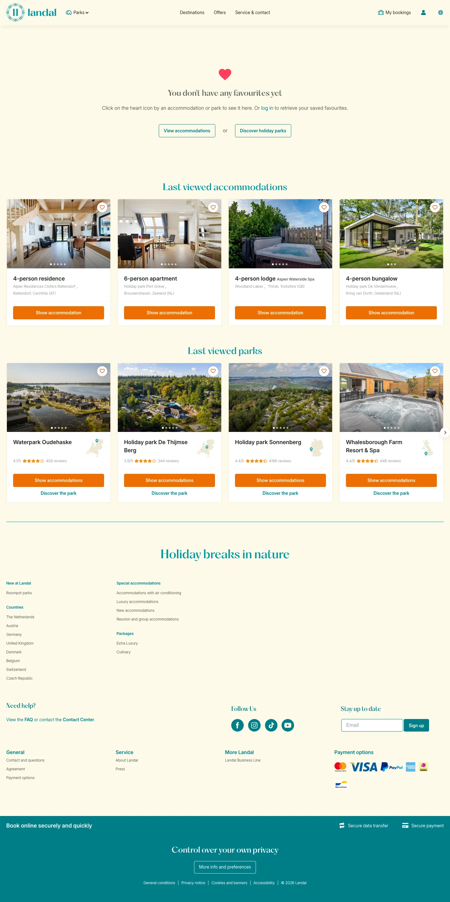

# My favourites at Landal

**URL:** `/favourites` · **Page type:** Favorites overview

## Section outline (top to bottom)

1. [Site Header](../components/site-header.md)
2. [Image With Text Card](../components/image-with-text-card.md)
3. [Accommodation Card Row](../components/accommodation-card-row.md)
4. [Accommodation Card Row](../components/accommodation-card-row.md)
5. [Site Footer](../components/site-footer.md)
