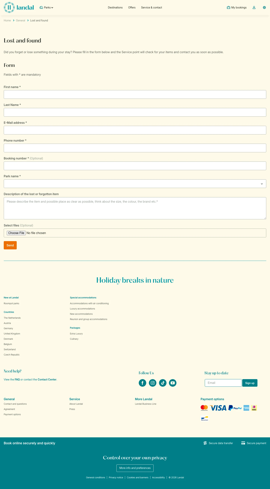

# Lost and found

**URL:** `/general/lost-and-found` · **Page type:** Theme inspirational

## Section outline (top to bottom)

1. [Site Header](../components/site-header.md)
2. [Cookie Bar](../components/cookie-bar.md)
3. [Lost Item Report Form](../components/lost-item-report-form.md)
4. [Site Footer](../components/site-footer.md)
