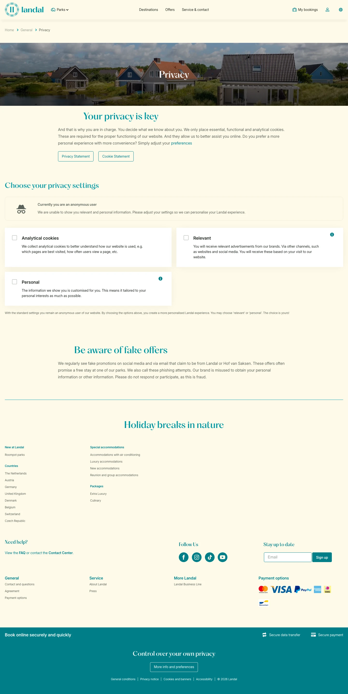

# Landal (general/privacy)

**URL:** `/general/privacy` · **Page type:** General

## Section outline (top to bottom)

1. [Site Header](../components/site-header.md)
2. [Cookie Bar](../components/cookie-bar.md)
3. [Photo Hero Banner](../components/photo-hero-banner.md)
4. [Cookie Bar](../components/cookie-bar.md)
5. [Privacy Settings Panel](../components/privacy-settings-panel.md)
6. [Cashback Terms List](../components/cashback-terms-list.md)
7. [Site Footer](../components/site-footer.md)
