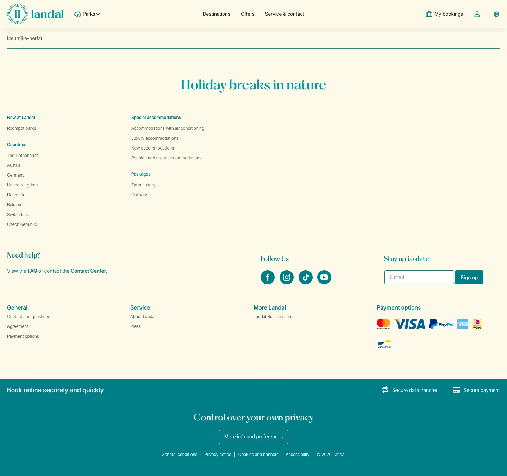

# kleurrijke-herfst

**URL:** `/landal-blog/park-stories` · **Page type:** /landal-blog/[*]

## Section outline (top to bottom)

1. [Site Header](../components/site-header.md)
2. [Site Footer](../components/site-footer.md)
