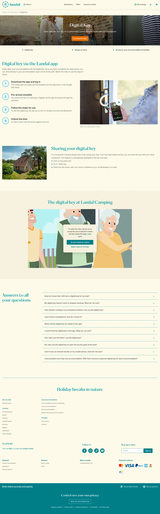

# Digital-key

**URL:** `/mobile-app/digital-key` · **Page type:** App detail

## Section outline (top to bottom)

1. [Site Header](../components/site-header.md)
2. [Cookie Bar](../components/cookie-bar.md)
3. [Photo Hero Banner](../components/photo-hero-banner.md)
4. [Cashback Terms List](../components/cashback-terms-list.md)
5. [Icon Column Info Section](../components/icon-column-info-section.md)
6. [Image Text Panel](../components/image-text-panel.md)
7. [Video Consent Gate](../components/video-consent-gate.md)
8. [Expandable Info Accordion](../components/expandable-info-accordion.md)
9. [Site Footer](../components/site-footer.md)
