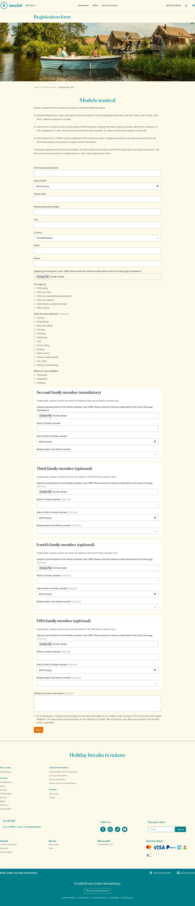

# Registration form

**URL:** `/models-wanted/inschrijfformulier` · **Page type:** Theme inspirational

## Section outline (top to bottom)

1. [Site Header](../components/site-header.md)
2. [Photo Category Tiles](../components/photo-category-tiles.md)
3. [Cashback Terms List](../components/cashback-terms-list.md)
4. [Personal Details Form](../components/personal-details-form.md)
5. [Personal Details Form](../components/personal-details-form.md)
6. [Personal Details Form](../components/personal-details-form.md)
7. [Personal Details Form](../components/personal-details-form.md)
8. [Personal Details Form](../components/personal-details-form.md)
9. [Photo Checklist Feature](../components/photo-checklist-feature.md)
10. [Photo Checklist Feature](../components/photo-checklist-feature.md)
11. [Photo Checklist Feature](../components/photo-checklist-feature.md)
12. [Site Footer](../components/site-footer.md)
