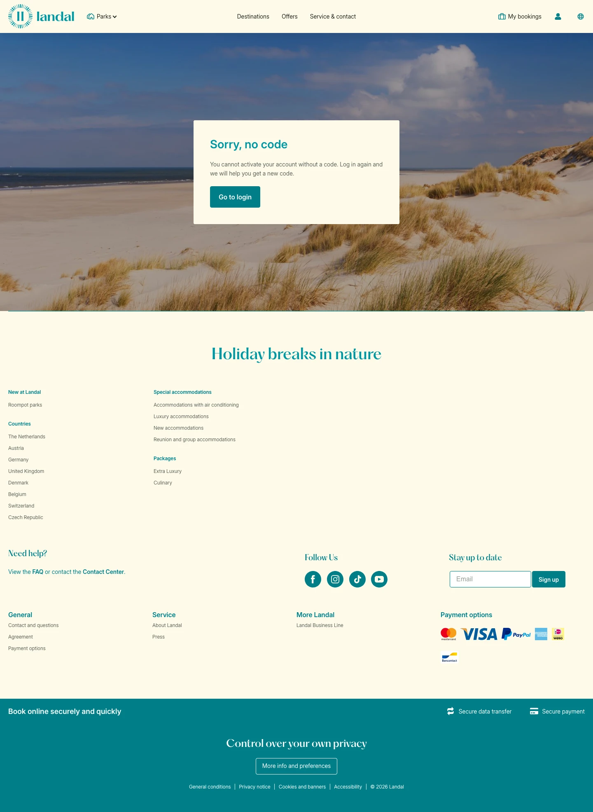

# Activate Account Login Page

**URL:** `/my-account/activate-account` · **Page type:** Account (each)

## Section outline (top to bottom)

1. [Site Header](../components/site-header.md)
2. [Site Footer](../components/site-footer.md)
