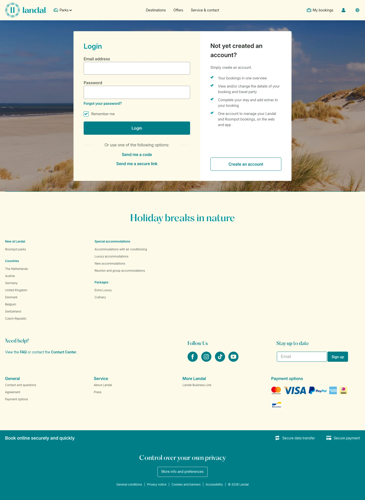

# Login My Account

**URL:** `/my-account` · **Page type:** Account login

## Section outline (top to bottom)

1. [Site Header](../components/site-header.md)
2. [Login And Registration Panel](../components/login-and-registration-panel.md)
3. [Accommodation Category Tiles](../components/accommodation-category-tiles.md)
4. [Site Footer](../components/site-footer.md)
