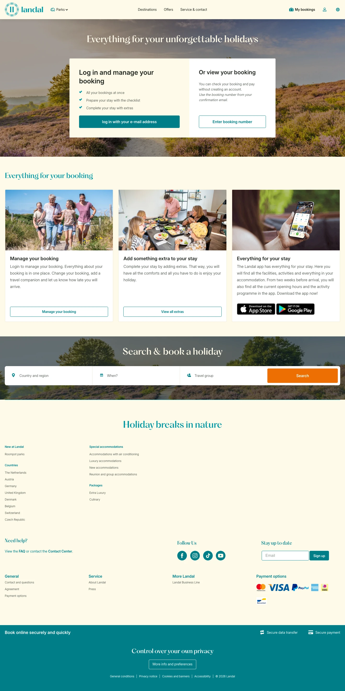

# My bookings at Landal

**URL:** `/my-bookings` · **Page type:** My bookings

## Section outline (top to bottom)

1. [Site Header](../components/site-header.md)
2. [Contact And Press Details](../components/contact-and-press-details.md)
3. [Contact And Press Details](../components/contact-and-press-details.md)
4. [Destination Search Hero](../components/destination-search-hero.md)
5. [Site Footer](../components/site-footer.md)
