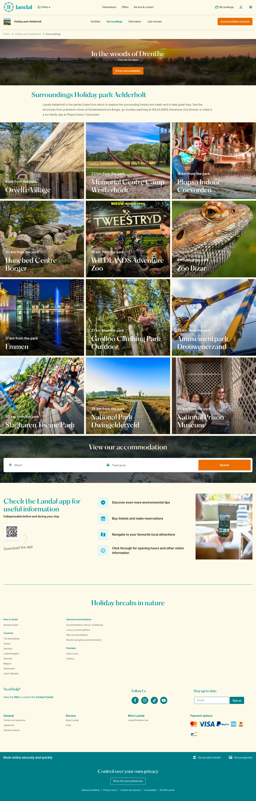

# Landal (aelderholt/surroundings)

**URL:** `/parks/aelderholt/surroundings` · **Page type:** Park surroundings

## Section outline (top to bottom)

1. [Site Header](../components/site-header.md)
2. [Cookie Bar](../components/cookie-bar.md)
3. [Cookie Bar](../components/cookie-bar.md)
4. [Facilities Text With List](../components/facilities-text-with-list.md)
5. [Nearby Attraction Tiles](../components/nearby-attraction-tiles.md)
6. [Nearby Attraction Tiles](../components/nearby-attraction-tiles.md)
7. [Nearby Attraction Tiles](../components/nearby-attraction-tiles.md)
8. [Nearby Attraction Tiles](../components/nearby-attraction-tiles.md)
9. [Destination Search Hero](../components/destination-search-hero.md)
10. [App Download Feature List](../components/app-download-feature-list.md)
11. [Site Footer](../components/site-footer.md)
