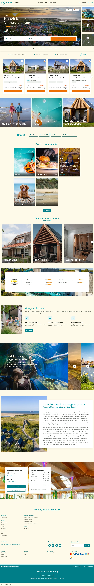

# Discover and book Beach Resort Nieuwvliet-Bad

**URL:** `/parks/beach-resort-nieuwvliet-bad` · **Page type:** Park homepage

## Section outline (top to bottom)

1. [Site Header](../components/site-header.md)
2. [Image And Text Section](../components/image-and-text-section.md)
3. [Highlight Icon Strip](../components/highlight-icon-strip.md)
4. [Large Photo Tiles](../components/large-photo-tiles.md)
5. [Quick Links Bar](../components/quick-links-bar.md)
6. [Facility Category Tiles](../components/facility-category-tiles.md)
7. [Contact And Press Details](../components/contact-and-press-details.md)
8. [Facility Icon List](../components/facility-icon-list.md)
9. [Expandable Info Accordion](../components/expandable-info-accordion.md)
10. [Photo Strip Banner](../components/photo-strip-banner.md)
11. [Image And Text Section](../components/image-and-text-section.md)
12. [Expandable Info Accordion](../components/expandable-info-accordion.md)
13. [Site Footer](../components/site-footer.md)
