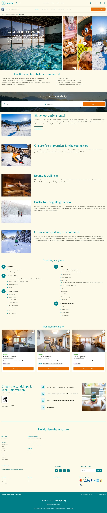

# Landal (brandnertal/in-and-around-the-park)

**URL:** `/parks/brandnertal/in-and-around-the-park` · **Page type:** Park facilities

## Section outline (top to bottom)

1. [Site Header](../components/site-header.md)
2. [Cookie Bar](../components/cookie-bar.md)
3. [Photo Strip Banner](../components/photo-strip-banner.md)
4. [Facilities Text With List](../components/facilities-text-with-list.md)
5. [Destination Search Hero](../components/destination-search-hero.md)
6. [Image With Text Card](../components/image-with-text-card.md)
7. [Image With Text Card](../components/image-with-text-card.md)
8. [Image With Text Card](../components/image-with-text-card.md)
9. [Image With Text Card](../components/image-with-text-card.md)
10. [Image With Text Card](../components/image-with-text-card.md)
11. [Facility Icon List](../components/facility-icon-list.md)
12. [Accommodation Card Row](../components/accommodation-card-row.md)
13. [App Download Feature List](../components/app-download-feature-list.md)
14. [Site Footer](../components/site-footer.md)
