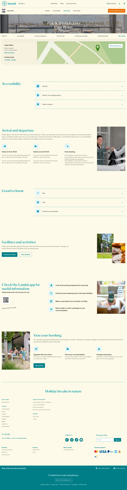

# Cape Helius address, route and map

**URL:** `/parks/cape-helius/information` · **Page type:** Park practical information

## Section outline (top to bottom)

1. [Site Header](../components/site-header.md)
2. [Photo Hero Banner](../components/photo-hero-banner.md)
3. [Photo Strip Banner](../components/photo-strip-banner.md)
4. [Expandable Info Accordion](../components/expandable-info-accordion.md)
5. [Icon Column Info Section](../components/icon-column-info-section.md)
6. [Expandable Info Accordion](../components/expandable-info-accordion.md)
7. [Photo Card Row](../components/photo-card-row.md)
8. [App Download Feature List](../components/app-download-feature-list.md)
9. [Expandable Info Accordion](../components/expandable-info-accordion.md)
10. [Site Footer](../components/site-footer.md)
