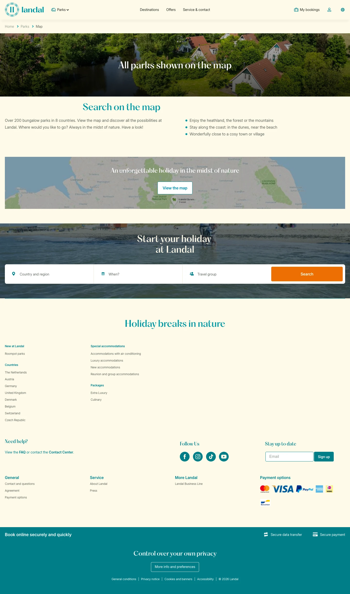

# All parks shown on the map

**URL:** `/parks/map` · **Page type:** Parks map

## Section outline (top to bottom)

1. [Site Header](../components/site-header.md)
2. [Photo Hero Banner](../components/photo-hero-banner.md)
3. [Destination Search Hero](../components/destination-search-hero.md)
4. [Site Footer](../components/site-footer.md)
