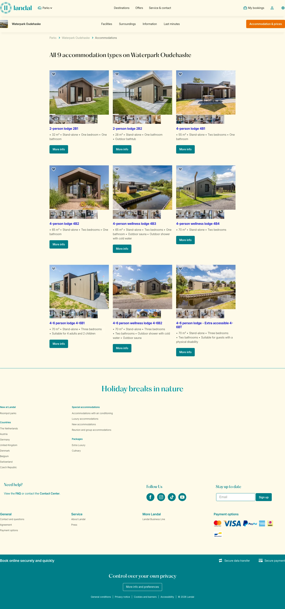

# Accommodations (waterpark-oudehaske/accommodations)

**URL:** `/parks/waterpark-oudehaske/accommodations` · **Page type:** Park accommodation overview

## Section outline (top to bottom)

1. [Site Header](../components/site-header.md)
2. [Cookie Bar](../components/cookie-bar.md)
3. [Accommodation Types Heading](../components/accommodation-types-heading.md)
4. [Accommodation Card Row](../components/accommodation-card-row.md)
5. [Accommodation Card Row](../components/accommodation-card-row.md)
6. [Accommodation Card Row](../components/accommodation-card-row.md)
7. [Accommodation Card Row](../components/accommodation-card-row.md)
8. [Accommodation Card Row](../components/accommodation-card-row.md)
9. [Accommodation Card Row](../components/accommodation-card-row.md)
10. [Accommodation Card Row](../components/accommodation-card-row.md)
11. [Accommodation Card Row](../components/accommodation-card-row.md)
12. [Accommodation Card Row](../components/accommodation-card-row.md)
13. [Site Footer](../components/site-footer.md)
