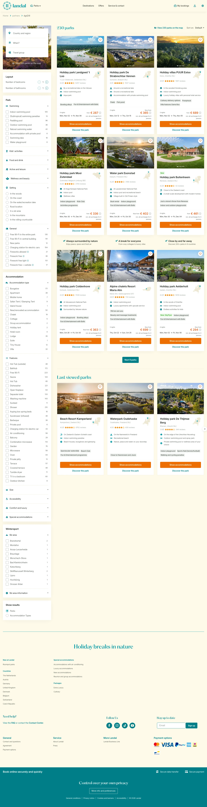

# dgd24l

**URL:** `/partners/dgd24l` · **Page type:** Partners

## Section outline (top to bottom)

1. [Site Header](../components/site-header.md)
2. [Cookie Bar](../components/cookie-bar.md)
3. [Price Availability Calendar](../components/price-availability-calendar.md)
4. [Site Footer](../components/site-footer.md)
