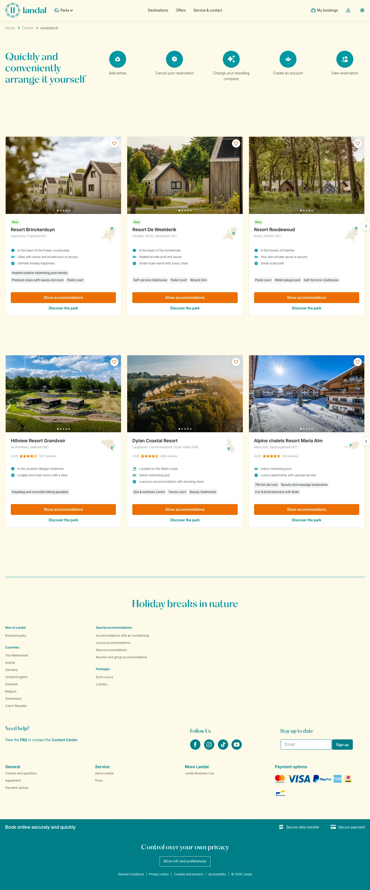

# romantisch

**URL:** `/theme/luxe-vakantie` · **Page type:** Theme (each)

## Section outline (top to bottom)

1. [Site Header](../components/site-header.md)
2. [Cookie Bar](../components/cookie-bar.md)
3. [Large Photo Tiles](../components/large-photo-tiles.md)
4. [Site Footer](../components/site-footer.md)
