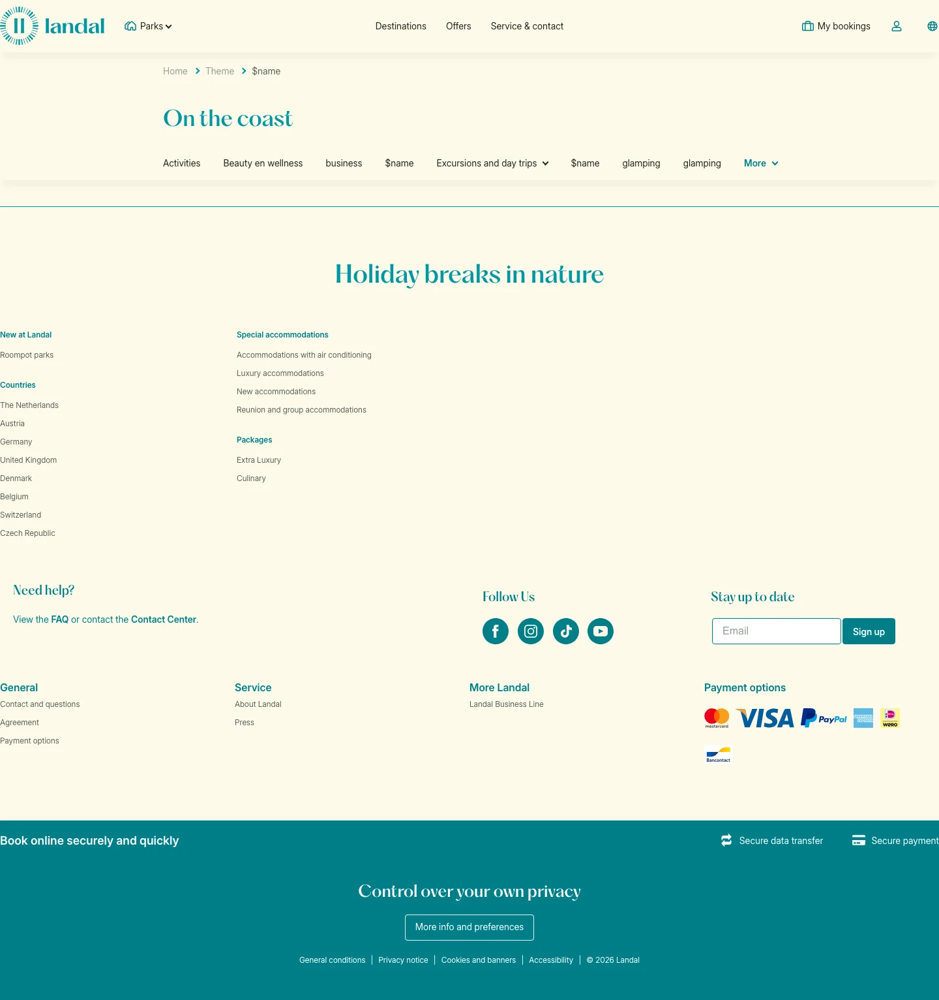

# Vakantie in de bergen

**URL:** `/theme/vakantie-in-de-bergen` · **Page type:** Theme (each)

## Section outline (top to bottom)

1. [Site Header](../components/site-header.md)
2. [Cookie Bar](../components/cookie-bar.md)
3. [Facilities Text With List](../components/facilities-text-with-list.md)
4. [Category Navigation](../components/category-navigation.md)
5. [Site Footer](../components/site-footer.md)
